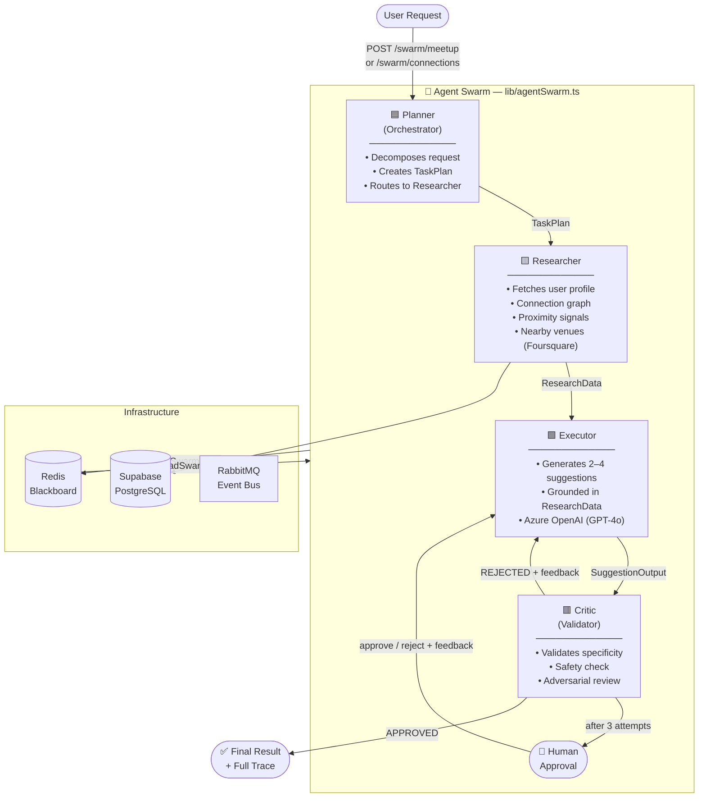
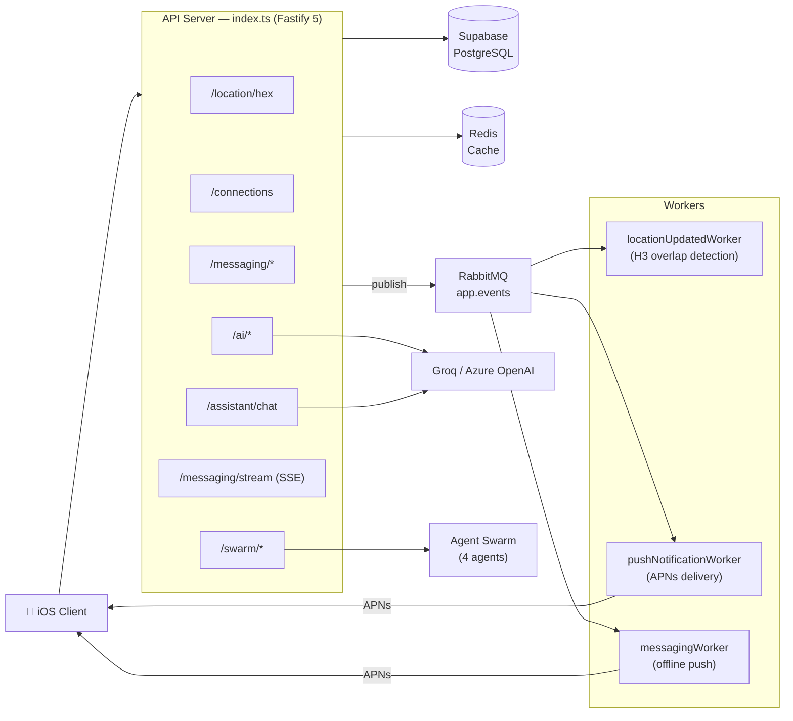

# Lokaal — Privacy-First Location-Based Social Platform

A production-grade Fastify/TypeScript backend for a location-based, end-to-end encrypted messaging and meetup platform, featuring a **4-agent AI swarm** for privacy-safe connection and meetup intelligence.

---

## AI Agent Swarm Architecture

The platform includes a multi-agent swarm (`/swarm/*`) that orchestrates 4 specialized agents to plan meetups and suggest connections using real proximity and interest data.



### Agent Roles

| Agent | Color | Responsibility |
|---|---|---|
| **Planner** | Cyan | Orchestrator — decomposes user request into a TaskPlan |
| **Researcher** | Yellow | Fetches live data: connections, proximity signals, nearby venues |
| **Executor** | Green | Generates personalized suggestions grounded in ResearchData |
| **Critic** | Red | Adversarial validator — rejects weak output, loops back up to 3× |

See [`agents.md`](agents.md) for the full Swarm Constitution and Rules of Engagement.

---

## System Architecture



---

## Key Features

- **Post-Quantum E2EE Messaging** — PQXDH (X3DH + ML-KEM-768) + double-ratchet chain management
- **AI Agent Swarm** — 4-agent adversarial loop with human-in-the-loop approval and full traceability
- **Location Proximity** — Uber H3 spatial indexing for privacy-safe proximity detection
- **Real-time Delivery** — Server-Sent Events (SSE) with cursor-based catchup
- **Azure OpenAI** — GPT-4o via Azure AI Foundry with Groq fallback
- **Redis Blackboard** — All swarm state persisted in Redis (Azure Cache for Redis in production)
- **Full Traceability** — Every agent step logged with timing, inputs, outputs (`GET /swarm/trace/:runId`)

---

## Swarm API

| Method | Endpoint | Description |
|---|---|---|
| `POST` | `/swarm/meetup` | Run the full meetup planning swarm |
| `POST` | `/swarm/connections` | Run the connection suggestion swarm |
| `GET` | `/swarm/trace/:runId` | Inspect the full agent thought process |
| `POST` | `/swarm/:runId/approve` | Human-in-the-loop: approve or reject with feedback |
| `GET` | `/swarm/status` | LLM provider health check |

All swarm endpoints require `Authorization: Bearer <JWT>`.

**Example — run meetup swarm:**
```bash
curl -X POST https://api.example.com/swarm/meetup \
  -H "Authorization: Bearer $JWT"
```

**Response:**
```json
{
  "success": true,
  "runId": "9f3a2c...",
  "phase": "complete",
  "llmProvider": "azure",
  "supervisor": { "approved": true, "attempts": 2, "lastFeedback": "..." },
  "result": {
    "taskType": "meetup",
    "meetupSuggestions": [
      {
        "type": "detailed",
        "connectionId": "uuid",
        "connectionName": "Priya",
        "title": "Afternoon code session",
        "place": "Blue Tokai Coffee Roasters",
        "time": "This Saturday, 3pm",
        "text": "You and Priya both love TypeScript and have been in the same area 4 times this week. Blue Tokai has great wifi and a quiet vibe — perfect for pairing on a side project."
      }
    ]
  },
  "trace": [
    { "agent": "planner", "status": "completed", "durationMs": 412, "outputSummary": "intent=\"Plan meetup suggestions\", tasks=4" },
    { "agent": "researcher", "status": "completed", "durationMs": 890, "outputSummary": "3 connections, 7 venues" },
    { "agent": "executor", "status": "completed", "durationMs": 1240, "outputSummary": "3 suggestions", "attempt": 1 },
    { "agent": "critic", "status": "rejected", "durationMs": 680, "outputSummary": "REJECTED: venue not in research data", "attempt": 1 },
    { "agent": "executor", "status": "completed", "durationMs": 1100, "outputSummary": "3 suggestions", "attempt": 2 },
    { "agent": "critic", "status": "approved", "durationMs": 620, "outputSummary": "APPROVED", "attempt": 2 }
  ]
}
```

---

## Setup (under 10 minutes)

### Prerequisites
- Node.js 20+
- Docker (for RabbitMQ)
- Supabase project
- Redis instance

### 1. Clone and install
```bash
git clone <repo-url>
cd main-logic
npm install
```

### 2. Configure environment
```bash
cp .env.example .env
```

Required variables:
```env
# Core
SUPABASE_URL=https://xxx.supabase.co
SUPABASE_SERVICE_ROLE_KEY=...
JWT_SECRET=...
REDIS_URL=redis://localhost:6379

# Azure OpenAI (recommended for hackathon demo)
AZURE_OPENAI_ENDPOINT=https://<resource>.openai.azure.com/
AZURE_OPENAI_API_KEY=...
AZURE_OPENAI_DEPLOYMENT=gpt-4o

# Fallback LLM (used if Azure not configured)
GROQ_API_KEY=...

# Venue data (Foursquare)
FOURSQUARE_API_KEY=...

# Messaging (optional for swarm demo)
SKIP_RABBITMQ=true
```

### 3. Start RabbitMQ (optional)
```bash
docker-compose up -d
```

### 4. Apply database migrations
```bash
# Via Supabase CLI
supabase db push
```

### 5. Start the API
```bash
npm run dev
```

### 6. Test the swarm
```bash
# Check provider status
curl http://localhost:3000/swarm/status

# Run a meetup swarm (requires valid JWT)
curl -X POST http://localhost:3000/swarm/meetup \
  -H "Authorization: Bearer $JWT"
```

---

## Project Structure

```
├── agents.md              ← Swarm Constitution
├── lib/
│   ├── agentSwarm.ts      ← 4-agent swarm (Planner, Researcher, Executor, Critic)
│   ├── azureClient.ts     ← Azure OpenAI / Groq LLM abstraction
│   ├── groqClient.ts      ← Existing AI (connections, interests, assistant)
│   └── ...
├── routes/
│   ├── swarm.ts           ← /swarm/* endpoints
│   ├── ai.ts              ← /ai/connections/suggestions, /ai/interests
│   ├── assistant.ts       ← /assistant/chat (tool-calling AI)
│   └── ...
├── shared/
│   ├── e2ee.ts            ← PQXDH + double-ratchet
│   ├── cryptography.ts    ← Noble.js wrappers
│   └── ...
├── workers/               ← RabbitMQ consumers
└── supabase/migrations/   ← Database schema
```

---

## Tech Stack

| Layer | Technology |
|---|---|
| API | Fastify 5 + TypeScript (ES2022) |
| AI Orchestration | Custom agent swarm — `lib/agentSwarm.ts` |
| LLM | Azure OpenAI (GPT-4o) · Groq (llama-3.3-70b) fallback |
| State / Blackboard | Redis (Azure Cache for Redis) |
| Database | Supabase / PostgreSQL |
| Cryptography | Noble.js — X25519, Ed25519, ML-KEM-768, AES-256-GCM |
| Messaging | RabbitMQ topic exchange |
| Location | Uber H3 spatial indexing |
| Real-time | Server-Sent Events (SSE) |
| Push | Apple Push Notification Service (APNs) |
| Venues | Foursquare Places API |
