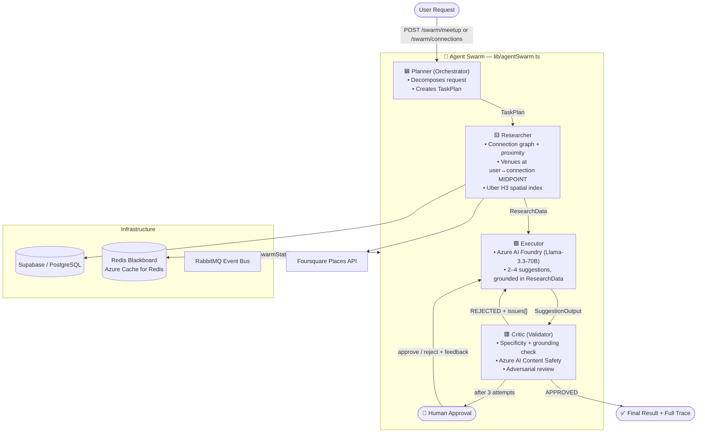
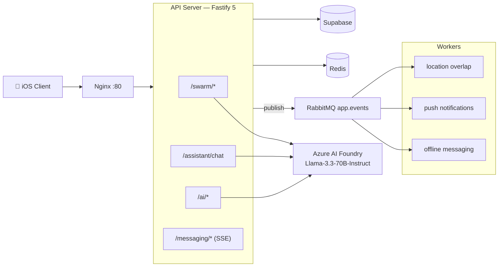

# Lokaal — A Privacy-First Proximity Network, Planned by an Agent Swarm

> **Microsoft Build AI Hackathon — Agent Swarm category**

Lokaal is a production-grade Fastify/TypeScript backend for a location-based, end-to-end encrypted social platform. Its centerpiece is a **4-agent AI swarm** — Planner → Researcher → Executor → Critic — that plans safe, specific, real-world meetups. Every suggestion is grounded in real connection and venue data, adversarially validated for safety and specificity, supervised by an optional human, and fully traceable.

Single-model AI hands you a confident answer you can't verify, can't audit, and can't trust. Lokaal's swarm refuses to surface a suggestion until four specialized agents agree it's grounded and safe.

---

## Architecture Diagram

> Rendered natively by GitHub (Mermaid). The same diagram is exported as an image in the slide deck (`deliverables/`).



### System Architecture



---

## Agent Constitution (Rules of Engagement)

The full constitution — each agent's Role, Goal, Tooling, and Handoff rules — lives in **[`agents.md`](agents.md)**. Summary of the rules every run must obey:

1. **No fabrication** — the Executor may only reference `connectionId`s and venue names present in `ResearchData`; the Critic rejects anything else.
2. **Specificity** — every meetup suggestion must name a specific person *and* a specific venue at a specific time. Generic suggestions are rejected.
3. **Privacy / data-minimization** — only first names, interests, and coarse midpoint location reach the model. No last names, contact info, or precise GPS. Only **mutually-accepted** connections are resolvable.
4. **Safety first** — the Critic rejects unsafe/inappropriate content; Azure AI Content Safety is integrated as an additional gate.
5. **Adversarial loop** — on rejection, the Critic returns specific `issues[]`; the Executor must address them. Max 3 attempts.
6. **Human-in-the-loop** — after 3 rejections the swarm pauses (`phase = "awaiting_human"`) for approval via `POST /swarm/:runId/approve`.
7. **Full traceability** — every step appends an `AgentTrace` (agent, timing, input/output summary, status); retrievable via `GET /swarm/trace/:runId`.
8. **Fail gracefully** — Planner falls back to a default plan; Critic fails open; errors surface as `phase = "error"` rather than crashing.

| Agent | Color | Responsibility |
|---|---|---|
| **Planner** | 🟦 Cyan | Orchestrator — decomposes the request into a TaskPlan |
| **Researcher** | 🟨 Yellow | Fetches connections, proximity signals, and **midpoint-grounded** venues |
| **Executor** | 🟩 Green | Generates suggestions grounded strictly in ResearchData (Azure/Llama) |
| **Critic** | 🟥 Red | Adversarial validator + Content Safety — rejects weak/unsafe output, loops back up to 3× |

---

## AI Tools Disclosed

Every Microsoft / external AI service used:

| Service | Where it's used |
|---|---|
| **Azure AI Foundry** — Llama-3.3-70B-Instruct (serverless, OpenAI-compatible) | The reasoning engine for **all four swarm agents** and the conversational assistant (`lib/azureClient.ts`, `lib/aiClient.ts`). Azure-only — there is no Groq fallback. |
| **Azure Cache for Redis** | The swarm "blackboard" — shared `SwarmState` persistence (`lib/redis.ts`). |
| **Azure AI Content Safety** | Integrated into the Critic agent as a configurable safety gate. |
| Foursquare Places API | Real venue data for the Researcher (`lib/foursquareClient.ts`). |
| Uber H3 | Privacy-preserving spatial indexing (coarse hex cells, never raw GPS). |
| n8n (automation layer) | Orchestrates the events-scraper and meetup workflows (`n8n-workflows/`). |

> **Orchestration note:** the swarm is a **custom TypeScript agent loop** (`lib/agentSwarm.ts`) inspired by Semantic Kernel handoff patterns — not a third-party framework dependency.

---

## Swarm API

| Method | Endpoint | Description |
|---|---|---|
| `POST` | `/swarm/meetup` | Run the full 4-agent meetup planning swarm |
| `POST` | `/swarm/connections` | Run the 4-agent connection suggestion swarm |
| `GET` | `/swarm/trace/:runId` | Inspect the full agent thought process (reads from Redis) |
| `POST` | `/swarm/:runId/approve` | Human-in-the-loop: approve or reject with feedback |
| `GET` | `/swarm/status` | LLM provider health check |

All swarm endpoints require `Authorization: Bearer <JWT>`.

**Validated response** (live run, Azure AI Foundry / Llama-3.3-70B):
```json
{
  "success": true,
  "runId": "53f68714-6961-428d-8cc6-dda876fc81bd",
  "phase": "complete",
  "llmProvider": "azure",
  "supervisor": { "approved": true, "attempts": 1, "lastFeedback": "All suggestions meet the required criteria" },
  "result": {
    "taskType": "meetup",
    "meetupSuggestions": [
      { "type": "detailed", "connectionId": "uuid", "connectionName": "Pooja", "title": "Coffee & catch-up", "place": "100 Feet Road, Chattarpur", "time": "This Saturday, 3pm", "text": "..." }
    ]
  },
  "trace": [
    { "agent": "planner",    "status": "completed", "durationMs": 6071, "outputSummary": "intent=\"plan meetup\", tasks=4" },
    { "agent": "researcher", "status": "completed", "durationMs": 2081, "outputSummary": "5 connections, 4 venues (midpoint-grounded)" },
    { "agent": "executor",   "status": "completed", "durationMs": 11108, "outputSummary": "3 suggestions", "attempt": 1 },
    { "agent": "critic",     "status": "approved",  "durationMs": 3995, "outputSummary": "APPROVED", "attempt": 1 }
  ]
}
```

---

## Setup

### Prerequisites
- **Docker** + Docker Compose (recommended path — runs the whole stack)
- Or: **Node.js 20+** for local dev
- A **Supabase** project and a **Redis** instance (managed `rediss://` works)
- An **Azure AI Foundry** deployment (Llama-3.3-70B-Instruct or compatible)
- API keys: Foursquare (venues); optional APNs (push), Ola Maps + n8n (automation)

### Installation
```bash
git clone <repo-url>
cd main-logic
npm install

# Configure environment — copy the template and fill in real values
cp .env.example .env
#   (edit .env — never commit it)
```

### Running the Swarm

**Option A — Full stack with Docker (recommended):**
```bash
# Builds the API image and starts api + workers + rabbitmq + n8n + nginx
docker compose -f docker-compose.prod.yml up -d --build

# Verify the swarm is live on Azure
curl -s http://localhost/swarm/status
# → {"success":true,"llmProvider":"azure","azureConfigured":true,"deployment":"Llama-3.3-70B-Instruct"}
```

**Option B — Local dev:**
```bash
docker compose up -d            # RabbitMQ only
npm run dev                     # API with hot reload on :3000
```

**Run a swarm and watch the agents collaborate:**
```bash
# Mint a short-lived test token (inside the running api container)
TOK=$(docker exec mainlogic-api node -e "const jwt=require('jsonwebtoken');process.stdout.write(jwt.sign({sub:'<USER_UUID>',phone:'+0000000000',type:'access'},process.env.JWT_SECRET,{expiresIn:'2h'}))")

# Trigger the meetup swarm (via the nginx gateway on :80)
curl -s -X POST http://localhost/swarm/meetup -H "Authorization: Bearer $TOK" | jq '{phase, llmProvider, supervisor}'

# Watch the colour-coded agent conversation in real time
docker compose -f docker-compose.prod.yml logs -f --tail=0 api | grep --line-buffered -E "PLANNER|RESEARCHER|EXECUTOR|CRITIC|SWARM"
```

---

## Project Structure

```
├── agents.md              ← Swarm Constitution (Rules of Engagement)
├── .env.example           ← Environment template (no secrets)
├── deliverables/          ← Hackathon submission bundle
├── lib/
│   ├── agentSwarm.ts      ← 4-agent swarm (Planner, Researcher, Executor, Critic)
│   ├── azureClient.ts     ← Azure AI Foundry client
│   ├── aiClient.ts        ← Assistant + connection/interest AI (Azure)
│   ├── connectionContext.ts ← Accepted-connection resolution + midpoint() helper
│   └── ...
├── routes/
│   ├── swarm.ts           ← /swarm/* endpoints
│   ├── assistant.ts       ← /assistant/chat (connection-aware, tool-calling)
│   └── ...
├── shared/                ← E2EE (PQXDH + ML-KEM-768), H3, auth
├── workers/               ← RabbitMQ consumers
├── n8n-workflows/         ← Automation layer
└── supabase/migrations/   ← Database schema
```

---

## Tech Stack

| Layer | Technology |
|---|---|
| API | Fastify 5 + TypeScript (ES2022, strict) |
| AI Orchestration | Custom agent swarm — `lib/agentSwarm.ts` |
| LLM | **Azure AI Foundry — Llama-3.3-70B-Instruct** (Azure-only) |
| State / Blackboard | Redis (Azure Cache for Redis) |
| Safety | Azure AI Content Safety (Critic gate) |
| Database | Supabase / PostgreSQL |
| Cryptography | Noble.js — X25519, Ed25519, ML-KEM-768, AES-256-GCM |
| Messaging | RabbitMQ topic exchange · Server-Sent Events |
| Location / Venues | Uber H3 spatial indexing · Foursquare Places API |
| Deploy | Docker Compose (api + 3 workers + rabbitmq + n8n + scraper + nginx) |

---

## Team Roles

This project was built **solo**.

| Member | Role | Responsibilities |
|---|---|---|
| **Akash** ([@bekindamen](https://github.com/bekindamen)) | Founder & Full-Stack Engineer | End-to-end ownership: agent swarm design & orchestration (`agentSwarm.ts`), Azure AI Foundry integration, connection-aware planning, E2EE messaging, location/proximity engine, infrastructure (Docker, RabbitMQ, n8n), and all submission deliverables. |

> _Solo build — a single engineer shipped the full production-grade, containerized multi-agent system._
